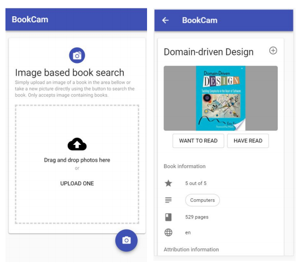
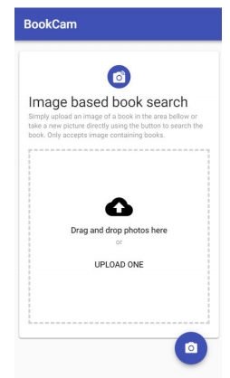
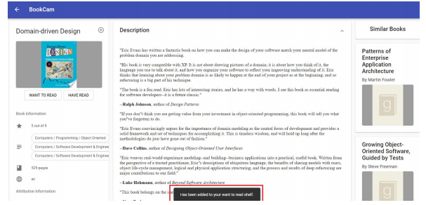

# cab432-api-mashup
The first project of the QUT course CAB432. It combines the Google Vision, Google Books, Goodreads and Bol.com API into image based search system which can manage your Goodreads library.

## Use case
The user navigates to the index page. On this page the user will take a photo or upload a photo of the book in question. 

If the user has uploaded an image that does not contain a book the user will be shown an error dialog. However if the image contains a book the image will be analysed and an automatic search query will be performed and the user will be show the 3 most likely books

The user will be redirected to a dedicated book page when the user click one of these books On this page the user will be provided with all kinds of information of the book in the image, such as a description, author information, related books, reviews, etc.

## Credential setup
Before you can use the project you must create the following JSON credential files in the credentials folder:
 **bolComApiKey.json**
 

    { 
	    "key" : "TODO"
    }
    
 **goodReadsApiKey.json**
 

    {
	    "key" : "TODO",
	    "secret": "TODO"
	}
    
 **googleVisionApiKey.json**
 

    {
	 "type": "TODO",
	 "project_id": "TODO",
	 "private_key_id": "TODO",
	 "private_key": "TODO",
	 "client_email": "TODO",
	 "client_id": "TODO",
	 "auth_uri": "TODO",
	 "token_uri": "TODO",
	 "auth_provider_x509_cert_url": "TODO",
	 "client_x509_cert_url": "TODO"
	}

    

## Running the application manually
Run the following command:

    npm install
    npm run-script build
    npm start
    
## Running the application in docker
Run the following command:

    docker build -t <IMAGE_NAME> .
    docker run --name=<CONTAINER_NAME> --publish=80:8080 <IMAGE_NAME>
    
## Running the application from DockerHub
Run the following command:

    docker pull j0rd1smit/cab432-api-mashup
    docker run --name=<CONTAINER_NAME> --publish=80:8080 j0rd1smit/cab432-api-mashup

